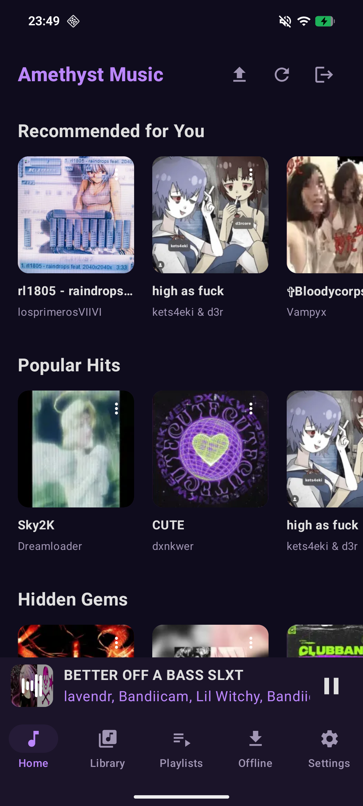
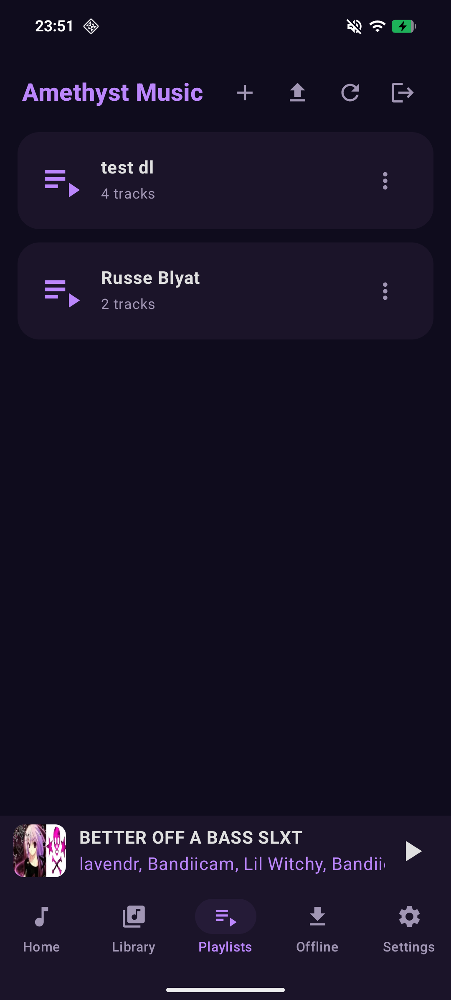
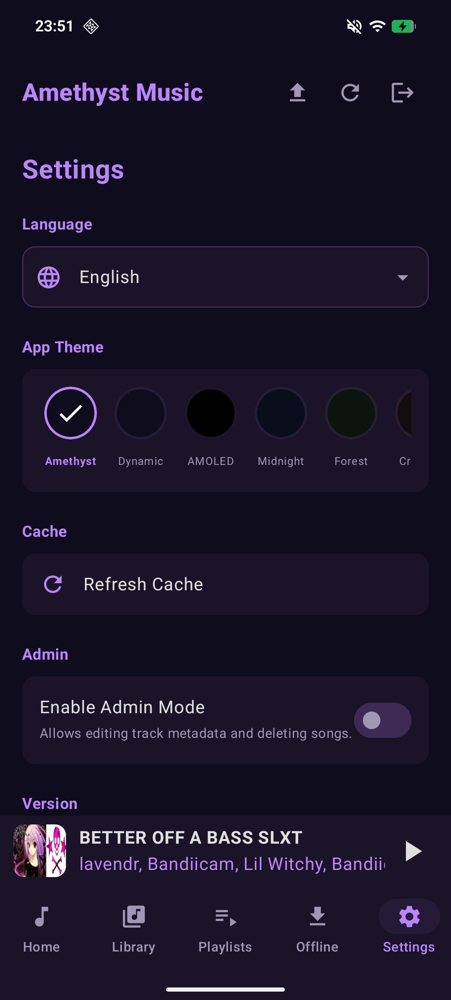

# Amethyst Music

Amethyst Music is a modern, Android music player client designed to connect with **Purple Music** (SQLite) and **Amethyst Music** (MySQL) backends. Built with Jetpack Compose and Material 3, it offers a seamless and beautiful music streaming experience.

Full Release 1.0 Soon.

## 📱 Screenshots

| Home | Library | Playlist | Downloads | Settings |
|------|---------|----------|-----------|----------|
|  |  |  |  |  |

## ✨ Features

- 🎵 **High-Quality Playback**: Powered by Android Media3 (ExoPlayer).
- 📥 **Offline Mode**: Download your favorite tracks and listen without an internet connection.
- 🎨 **Customizable Themes**: Personalize your experience with multiple presets including AMOLED, Midnight, Forest, and Crimson, or use Dynamic colors.
- 🌍 **Multi-language Support**: Fully translated into 11 languages.
- 🔍 **Smart Search**: Quickly find tracks in your library.
- 📜 **Playlist Management**: Create, edit, and manage your personal playlists directly within the app.
- 🛠️ **Admin Tools**: Upload, edit, and delete tracks directly from the interface (for authorized administrators).
- 🛡️ **Secure Connectivity**: Support for custom server URLs and options to bypass HTTPS errors for self-signed certificates.

## 🌍 Supported Languages

Amethyst Music supports the following languages:

- 🇺🇸 **English** (English)
- 🇫🇷 **French** (Français)
- 🇩🇪 **German** (Deutsch)
- 🇮🇹 **Italian** (Italiano)
- 🇪🇸 **Spanish** (Español)
- 🇨🇭 **Romansh** (Rumantsch)
- 🇷🇺 **Russian** (Русский)
- 🇨🇳 **Chinese** (中文)
- 🇯🇵 **Japanese** (日本語)
- 🇮🇳 **Hindi** (हिन्दी)
- 🇲🇳 **Mongolian** (Монгол)

## 🛠️ Tech Stack

- **UI**: Jetpack Compose, Material 3
- **Navigation**: Compose Navigation
- **Image Loading**: Coil
- **Media**: Android Media3 (ExoPlayer, MediaSession)
- **Networking**: OkHttp
- **Architecture**: MVVM with ViewModel and LiveData/StateFlow

## 🚀 Getting Started

1.  **Clone the repository**:
    ```bash
    git clone https://github.com/your-username/AmethystMusic.git
    ```
2.  **Open in Android Studio**: Open the project folder.
3.  **Backend Setup**: Ensure you have a compatible Purple Music or Amethyst Music server running.
4.  **Build and Run**: Deploy the app to your device or emulator.

## 📋 To-Do

See Issues.
